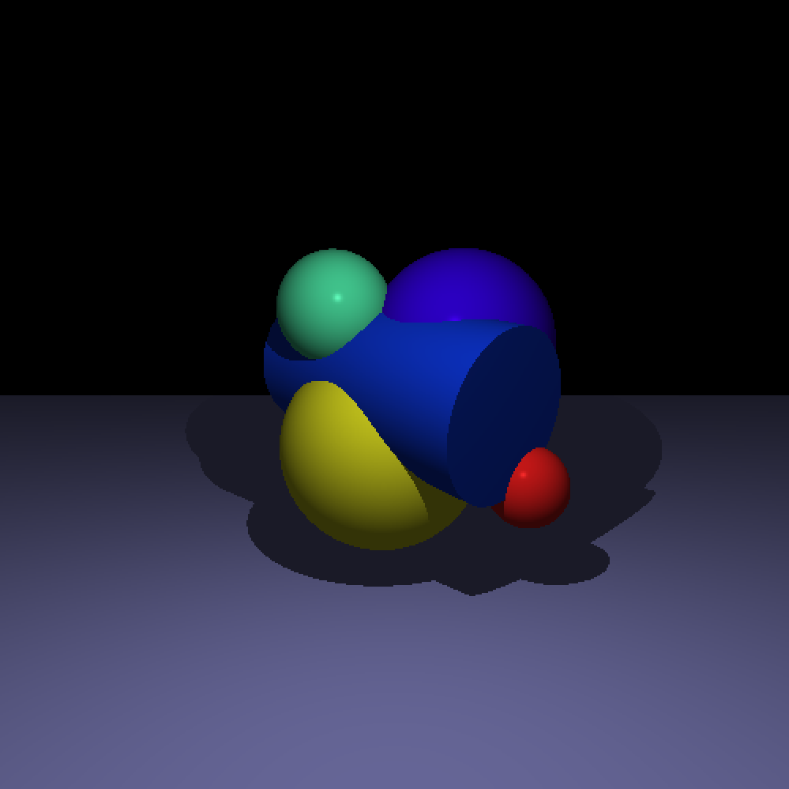
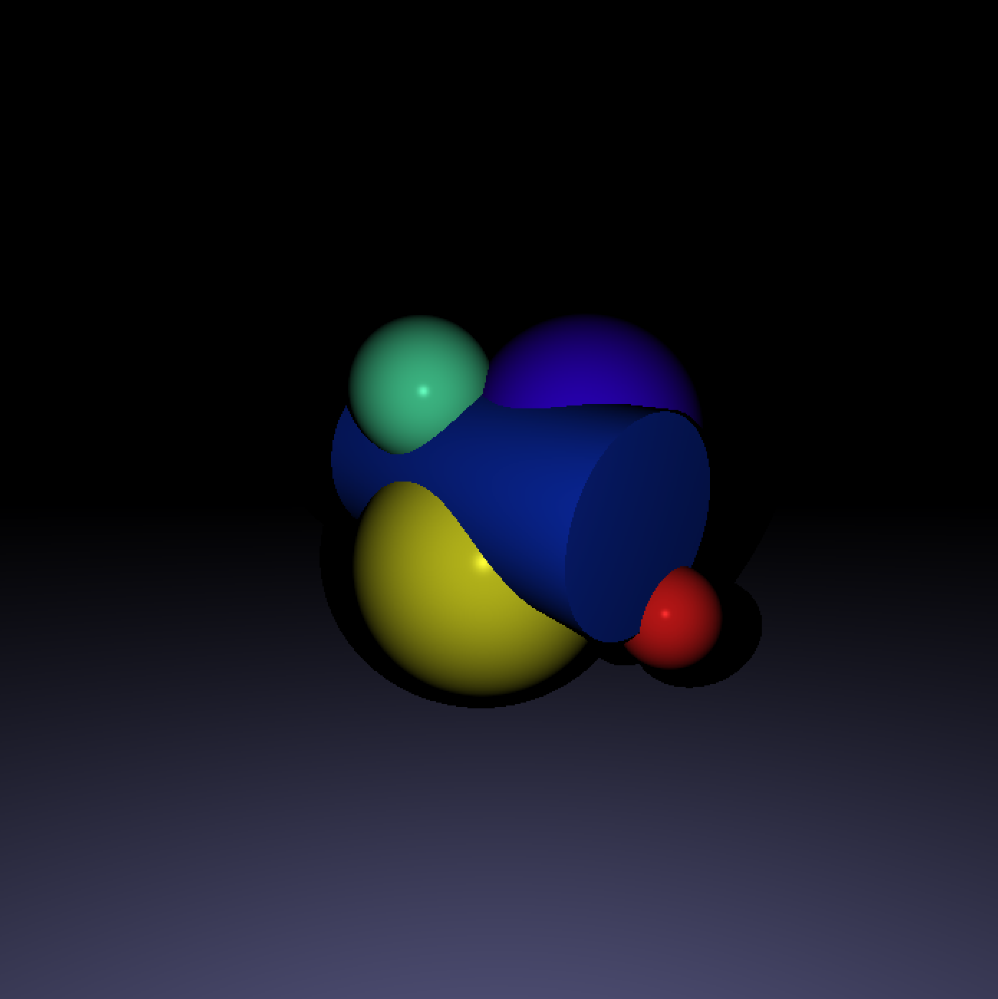
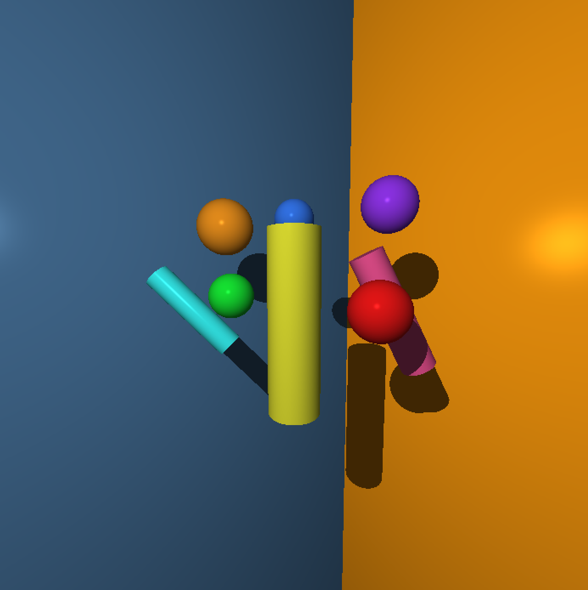
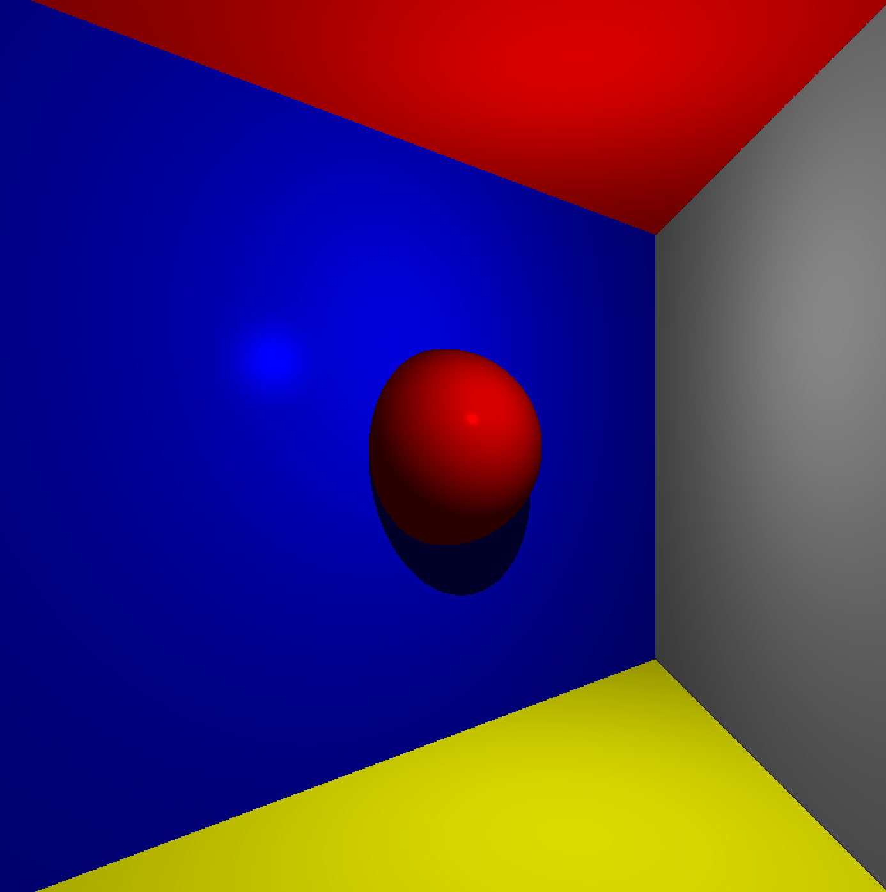

# MiniRt, raytracing from scratch

This project aims to explore the basics of one of the most popular techniques for realistic image generation: ray tracing.

Written in C and using the MiniLibX (X-Window programming API), it renders scenes composed of basic geometric primitives such as spheres, cylinders and planes, along with ambient and point lights and a camera defining the point of view.

The project implements the Phong lighting model, separating ambient, diffuse and specular components to achieve more realistic shine overall.

Since we use the MiniLibX API for linux, this program can only be used in Linux OS. You can build it using ```make``` and ```./miniRT <scene>.rt```

The program takes as input a .rt file where the properties of the scene are defined. From the position and size of the shapes to the camera and lighting properties. A basic example of an ```.rt``` scene:
```
A   0.2                                         255,255,255 //(Ambient light) lighting ratio, color
C   -50,0,20        0,0,1       70                          //(Camera) position, orientation, FOV
L   -40,0,30        0.7                         255,255,255 //(Light) position, brightness ratio, color
pl  0,0,0           0,1.0,0                     255,0,225   //(Plane) point, normal vector, color
sp  0,0,20          20                          255,0,0     //(Sphere) position, diameter, color
cy  50.0,0.0,20.6   0,0,1.0     14.2    21.42   10,0,255    //(Cylinder) position, direction, diameter, height, color
```

To change the window resolution, go to ```include/mini_rt.h``` and adjust width and height values: 
``` 
# ifndef WIDTH
#  define WIDTH 700
# endif
# ifndef HEIGHT
# 	define HEIGHT 700
# endif
 ```
<table align="center">
  <tr>
    <td></td>
    <td></td>
    <td></td>
  </tr>
</table>





The main resource to develop this ray tracer was the book *The Ray Tracer Challenge* by Jamis Buck, which describes step-by-step the basics and guidelines to build a ray tracing engine.
[The Ray Tracer Challenge](http://raytracerchallenge.com/)
